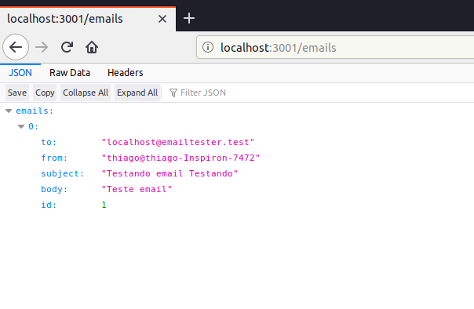
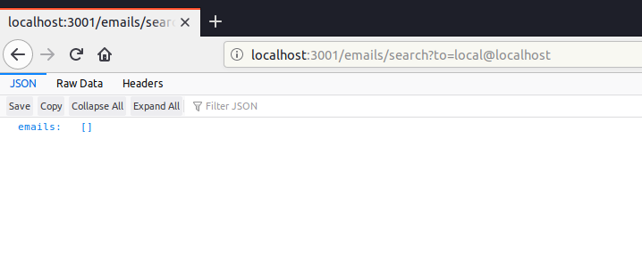
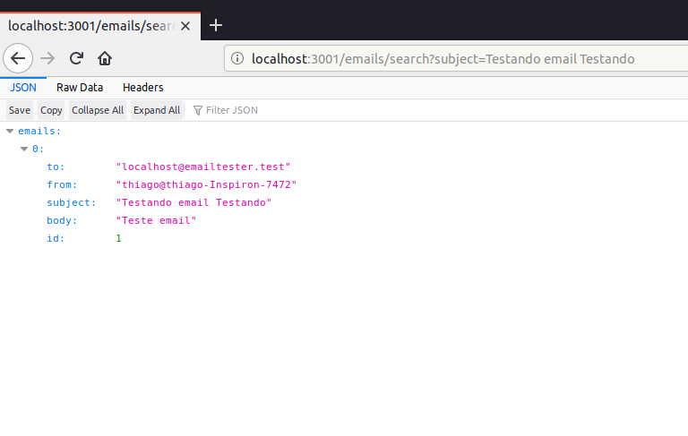

# Email-server

This is a NodeJS project, build using typescript.

Email-server is a simple node project to help people deal with emails. It was build on top of [Express](https://expressjs.com/) and [Nodemailer](https://github.com/nodemailer/smtp-server) packages.

## Usage

First check if you have [npm](https://www.npmjs.com/) or [yarn](https://yarnpkg.com/lang/en/) installed using the flowing command to check it version:

```bash
npm -v
yarn -v
```

If an error occurs, install either npm or yarn to continue.

After cloning the repository you need to install the dependencies of the project to run it. To do so, run in the root of the application:

```bash
npm install
```

or

```bash
yarn install
```

Now you should be able to run the project. Run:

```bash
npm start
```

After the application compile and start you should see something like this:

```bash
REST Server alive on port 3001
Email:	Server started, listening on port 25.
	Send Email to some_user@emailtester.test
```

## Features

Email-server receives emails and saves them on a storage that is shared by the email server and a express server. You can test if your email client is working correctly by sending emails and checking in the api if they really were sent. That being said, it does not implement any authentication or store/differentiate user information.

The API have only 2 endpoints: `/emails` and `/emails/search`.

- `/emails` List in json format all emails received.
- `/emails/search` should receive params to use as query to search. Params that can be passed are: `to`, `from`, `subject`,`id`.

### Examples

### Index

It's possible to send email using the existent script `random.sh`. So, with your server open, run:

```bash
./scripts/random.sh
```

This should send a email to the server and after is finished it should be saved. To check, go to your browser and enter in `localhost:3001/emails` and you should see:



### Searching

After doing what was described above, type in your browser `localhost:3001/emails/search?to=local@localhost`.



Or `http://localhost:3001/emails/search?subject=Testando%20email%20Testando`



## Possible Errors

### Port

The email server run on port 25 so if you see any errors saying that something is already using that port you should disable it or change email port by adding the line in index.ts:

```js
const email_controller = new EmailServerController({name: "emailtester.test"}, storage);
const rest_controller = new RestServerController(storage);

email_controller.PORT = 105 // New line. Use any port you prefer

rest_controller.init();
email_controller.init()
```

You can check what programs are using each port using the comand:

```bash
sudo lsof -i -P -n | grep LISTEN
```

### Sendmail

Sendmail by default use port 25. If you want to disable it temporarily run on bash:

```bash
sudo /etc/init.d/sendmail stop
```

<!-- ## CLI

The cli implementation is used to send emails. Params that can be passed:

- `-from [user@host]`: default is `local@localhost`
- `-to [user@host]`: default is `local@localhost`
- `-subject [email subject]`: default is `This is for you`
- `-body [email message]`: default is `Hello world` -->
